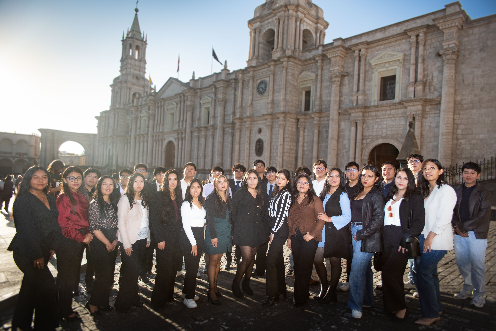
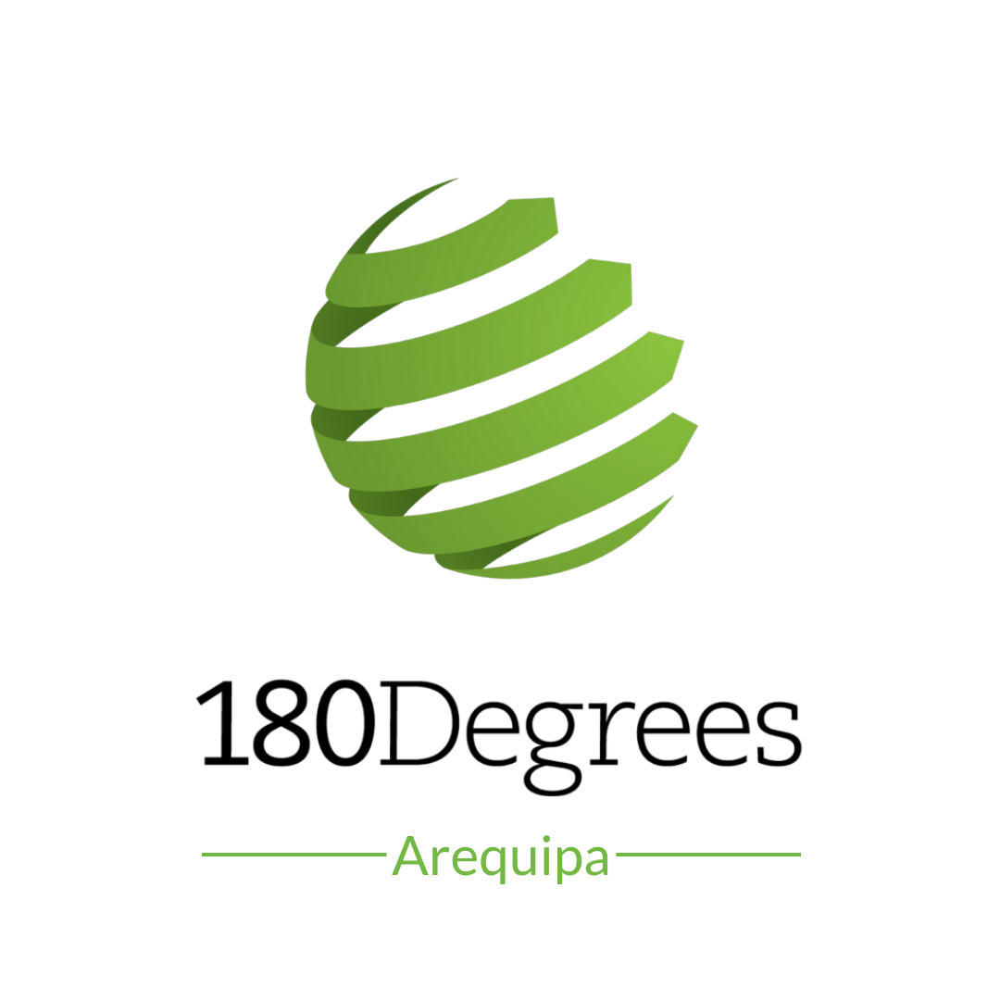

# 👋 Welcome to 180 Degrees Consulting — Arequipa (AQP) 🇵🇪

<strong>Student-led consulting for social impact.</strong>

  

  <strong>180 Degrees Consulting Arequipa</strong> is a student-led consulting branch founded in <strong>2026</strong> by students from the Universidad Nacional de San Agustín de Arequipa (UNSA). We are part of the global <a href="https://180dc.org/">180 Degrees Consulting</a> network — the world's largest student-driven consultancy for nonprofits and social enterprises — bringing together motivated students who want to use their knowledge and creativity to address real-world challenges.

  Our branch was created with a clear purpose: to connect university talent with organizations working to create positive change in society. Through consulting projects, we support social enterprises, nonprofits, and purpose-driven initiatives in developing practical and sustainable solutions to their challenges.

  We believe that meaningful impact comes not only from the solutions we deliver, but also from the people behind them. Our mission is to empower students to create lasting social impact while bridging the gap between academic knowledge and real-world application.

  

  Born within UNSA, our branch brings together students from different backgrounds, disciplines, and areas of expertise. We believe that diversity of thought leads to better solutions — and that is exactly what our multidisciplinary teams are built for.

  From technology and digital transformation to strategy, operations, marketing, and data analytics, our consultants work collaboratively alongside organizations to understand their context and deliver actionable recommendations tailored to their needs.

  Beyond consulting, 180DC Arequipa is a platform for learning and leadership. Our members gain hands-on experience on real projects, strengthen their problem-solving and communication skills, and grow as professionals while contributing directly to the development of our community.

  <picture>
    <source media="(prefers-color-scheme: dark)" srcset="images/ModoOscuroLogotipo.png">
    <source media="(prefers-color-scheme: light)" srcset="images/ModoBlancoLogotipo.png">
    
  </picture>

  As a young branch, we are building more than a consulting organization — we are building a community of young people committed to using their knowledge for a purpose greater than themselves. Impact, excellence, collaboration, and integrity guide everything we do.

  Established in Arequipa in 2026, we aim to grow a strong local consulting community while contributing to organizations and initiatives that create positive change across the region and beyond.

<strong>Students. Consultants. Changemakers.</strong> Connecting talent with purpose to create meaningful impact.

